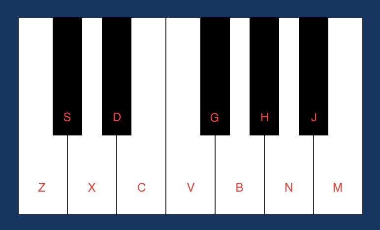

# Piano

A simple piano website in HTML, CSS and JavaScript.

💡 You don't need to know how to play piano to play with it.

> **_Pro tip:_** You can play with the keyboard 👇



## Simple musics to play

### Wedding music 💍

- ZZ C BB BB CC
- ZZ C BB BB VV
- XX V NN VBC
- Z CC XN BZ

## Small into of Fur Elise

- JNJNJ VHGD

# Setup

## Clone repository

Create and go to the directory where you want to place the repository

```bash
  cd my-directory
```

Clone the project

```bash
  git clone https://github.com/pncsoares/piano.git
```

Go to the project directory

```bash
  cd piano
```

Open in Visual Studio Code

```bash
  code .
```

- Expand `src` directory
- Right click on `Index.html` file
- Chose `Open with Live Server`

If you don't have the extension Live Server installed, you can find it [here](https://marketplace.visualstudio.com/items?itemName=ritwickdey.LiveServer)

# License

MIT